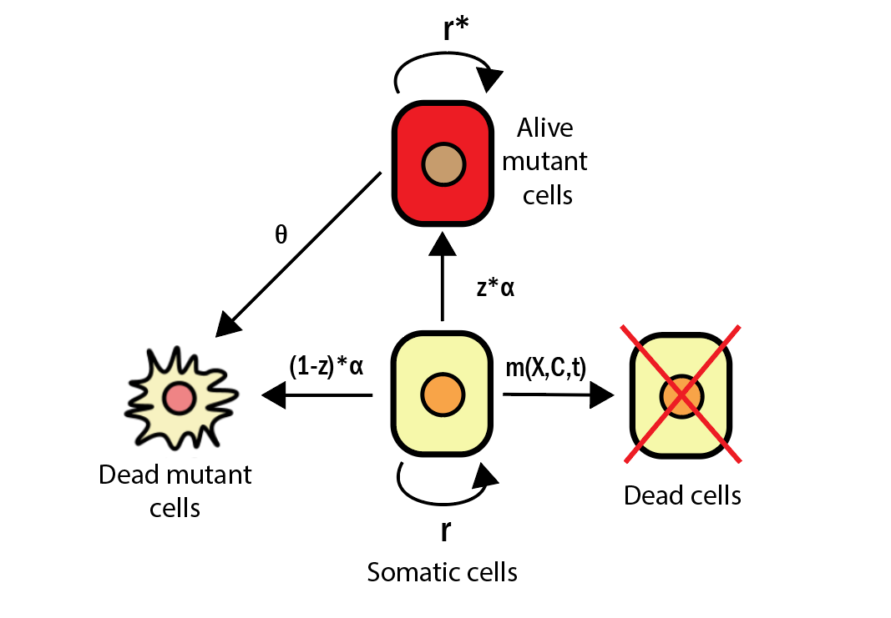
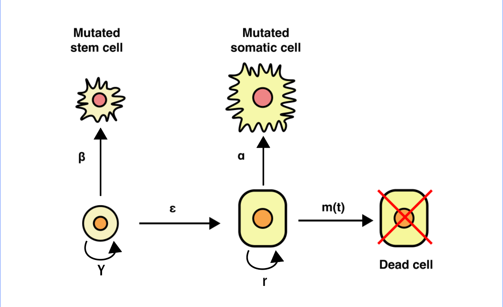

# Evaluating impact of somatic mutations on aging: a dynamical system approach
 Dynamical system and calculation of parameters for the publication.
 


# How to use

## First steps

You can look on the module code in ```lifespan_class.py```. To work with it, one should import it in his notebook by ```from lifespan_class import Somatic_LS```.

The ```__init__``` function has a following set of arguments:
```
class Somatic_LS(object):
    def __init__(
        self, 
        organ:str='liver', 
        method:str='RK45', 
        start_time:float=0, 
        end_time:float=300, 
        include_mutants:bool=False, 
        equation:str='single',
        print_config:bool=True,
        custom_conf:List = None,
        custom_thr:float = None,
        custom_init:List = None,
        style:str = 'bmh',
        print_methods:bool = False,
        print_styles:bool = False):
```

You can see that all the parameters have their default value.

To start a session you should specify a variable and connect it with class.

Example:

```
spinal_conf_ = Somatic_LS(organ = 'spinal cord', end_time=1500, include_mutants=False, method='RK45')
```

As all the parameters have default values you can launch it like this:

```
organ = Somatic_LS()
```
This will result in a simulation of liver with Model 1 and without alive mutants.

Next you can call any method that you want and get a desired result:

Example:
```
organ.plot_curves(population = 'somatic')
```

Visual style of plots is defined by default as 'bmh', but you can always change it by initializing ```style``` argument in class. 

You can also look on the available methods for solving a system by setting ```print_methods``` to True.

All of the parameters for organs described in the paper are located in the config which is defined using the function below

```
 def set_config(self) -> List:
        configs = {
            'liver': [0.087, 2e11, 2e11/94000, 4/407, 0.064, (3.5e-9)*9.6e-3, (1.83e-9)*9.6e-3, 4/407, 0.9, 0.239],
            'mouse liver': [0.087, 3.37e8, 3.37e8/94000, 63/407, 0.064, 35*(3.5e-9), 35*(1.83e-9), 63/407, 0.9, 0.239],
            'lungs': [0.073, 10.5e9, 0.07*10.5e9, 0.001/407, 0.007, 6.392476819356688e-12, 6.392476819356688e-12 / 1.9126, 0.001/407, 0.9, 0.239],
            'spinal cord': [0.085, 222e6, 0, 0, 0, 0.9047619*(3.5e-9)*0.0013563, 0, 0, 0.9, 0.239]
        }
        return configs.get(self.organ, configs['liver'])
```

As the solving method we use 'RK45' because after a lot of experimentation we can conclude that it is the most stable one.

## Choosing model

We grant access to the two models featured in the article. 

### Model 1 ('single equation')



This model features somatic cells population and populations of mutated and dead cells. It can be used in cases where there is a small amount of progenitor/stem cells and their impact can be neglected.

It is called 'single equation' because if we remove the feature of mutant and dead cells populations we end up with equation only for somatic population without another equation for stem cells.

This version of the dynamical system can be applied to all of the organs.

Dynamical system:

$\dot X = rX(1 - \frac{X}{K}) - \alpha X - m(t, X)$

$\dot C = rC(1 - \frac{C}{K}) + z \alpha X - \theta C$

$\dot F = \alpha X (1 - z) +  \theta C$

$m(t, X) = \frac{(C+ (1-z)\alpha X t + \theta C t )^{2} \sigma}{2} [1 - \frac{X}{K}]$

Code:
```
    def model_one(self, t, y, s, K, M, r, e, a, b, g, z, d) -> List:
        X, C, F = y
        m1 = 0.5 * s * (1 - X / K)
        dXdt = r * X * (1 - X / K) - a * X - m1 * ((C + (1 - z) * a * X * t + d * C * t) ** 2)
        dCdt = r * C * (1 - C / K) + z * a * X - d * C
        dFdt = (1 - z) * a * X + d * C
        return [dXdt, dCdt, dFdt]
```

### Model 2 ('two equations')
This model includes somatic and stem cells populations without accounting for the fact that mutated cells can also divide and make up their own population. 



This model can be applied to the liver and lungs and it should always be used in cases where organ has a lot of progenitor/stem cells and their impact can not be neglected. It can't be used with the spinal cord and if you try to do so the module will automatically change type of equation to Model 1.

Dynamical system:

$\dot X = rX(1 - \frac{X}{K}) + 2 \epsilon Y - \alpha X - m(t, X, Y)$

$\dot Y = \gamma Y(1 - \frac{Y}{M}) - \beta Y - \epsilon Y$

$m(t, X, Y) = \frac{(\alpha X + \beta Y)^{2} \sigma}{2} t^{2} [1 - \frac{X + Y}{K + M}]$

Code:
```
    def model_two(self, t, y, s, K, M, r, e, a, b, g, z, d) -> List:
        X, Y, m = y
        m1 = 0.5 * s * (1 - (X + Y) / (K + M))
        dXdt = r * X * (1 - X / K) + 2 * e * Y - a * X - m1 * ((a * X + b * Y) ** 2 * t ** 2)
        dYdt = g * Y * (1 - Y / M) - e * Y - b * Y
        dmdt = 0.5 * s * (1 - (X + Y) / (K + M)) * ((a * X + b * Y) ** 2 * t ** 2)
        return [dXdt, dYdt, dmdt]
```

## Obtaining lifespan

To obtain the lifespan of chosen organ do these steps.

Define which organ you want to assess, which model to use, limit the maximum time (measurement units are years) and choose whether you want to include mutant and dead cells population or not (this option can be used only with single equation version).

Example:

```
z = Somatic_LS(organ = 'lungs',equation = 'single', end_time = 300, include_mutants=True)
```

Equation we use in this example is 'single' which correspond to the Model 1. To use Model 2 write equation = 'two'.

To obtain the lifespan value and plot the somatic cells population this code is used:

```
z.plot_curves(view_all = True, plot_thr = True)
```
There are multiple options in the plot_curves function:

view_all - makes plot go up to the end_time value. Otherwise it stops at the time of death.

plot_thr - plots threshold after crossing which organ dies.

proportions - presents values from the y axis be represented not as an amount of cells but as a percent of organ mass (values range from 0 to 1).

population - which population of cells you want to observe. For model 1 you can use 'somatic', 'alive mutants', 'dead mutants' or 'mortality function'. For model 2 'somatic', 'stem' and 'mortality function' too. By default somatic cells are plotted.

## Varitator

This function allows to observe how changes in different vairables affect overall lifespan of the chosen organ.

```
z.variator(x_bound=300, d_max=0.9, d_min=0.1, fraction = 10, sampling_freq=10, z_min=0.5, z_max=0.9)
```

By deafult only the $\alpha , \theta, z, \sigma$ are varied for Model 1 and $\alpha$, $\sigma$, $\beta$ and $\epsilon$ for Model 2. If you want you can vary $r$ by using only_r = True option in the variator function.

## Documentation

For every function that is present in a module you can obtain an explicit documentation with types of all variables specified. 

For example method .plot_curves():

```
def plot_curves(
        self, 
        population:str = 'somatic', 
        view_all:bool = False, 
        proportions:bool = True, 
        plot_thr:bool = True) -> None:

        '''
            ####Plot results of simulation.

            ######
            Args: population - type of population, view_all - show only till the moment of death or not, 
            proportions - plot as population/(population limit), plot_thr - plot cutoff value

            ######
            Output: matplotlib.pyplot plots, lifespan
        '''
```
Or .variator():

```
def variator(
        self, 
        fraction:float = 5, 
        sampling_freq:int = 4, 
        x_bound:float = 300, 
        only_z:bool=False, 
        only_r:bool=False, 
        only_sigma:bool=False, 
        only_alpha:bool=False, 
        only_d:bool=False,
        z_min:float=0.1, 
        z_max:float=0.9,
        d_min:float=0.1,
        d_max:float=0.9, 
        legend:bool=True,
        proportions:bool=True) -> None:

        '''
            ####Perturb the parameters of a system to see the results.

            ######
            Args: fraction for interval as {parameter/fraction; parameter*fraction}, sampling_freq - amount of equidistant points to separate the interval, 
            x_bound = cut the plot on this value of time, only_* - variate only * parameter, {z_min; z_max} and {d_min;d_max} - bounds for proportion of alive mutants and their death rate,
            legend - show legend on plot or not, proportions - whether on not to plot population as a fraction of K.

            ######
            Output: plots and lifespans
        '''
```

Variable types are provided for all methods of a class. Text documentation is given for ```__init__```, ```.plot_curves()```, ```.variator()```, ```.lifespan()``` and ```.calculate_population()```. For better understanding of how the class methods work, one can look in ```testing.ipynb``` which is located in this repository.

## Simulation with custom parameters

You can also run the simulation with your own config defined. Given a name of an organ that is not specified inside ```__init__``` will result in simulation with custom set of parameters. 

You should specify your config, initial conditions and cutoff value inside a class. 

Example:

```
conf = [2*0.087, 2*2e11, 2*2e11/94000, 2*4/407, 2*0.064, 2*(3.5e-9)*9.6e-3, 2*(1.83e-9)*9.6e-3, 2*4/407, 0.9, 0.239]
custom_init_two = [0.6*conf[1], 0.6*conf[2], 0]
custom_init_single = [0.6*conf[1], 0, 0, 0]
custom_thr = 0.2

custom = Somatic_LS(organ='custom', equation='single',include_mutants=True, custom_conf=conf, custom_init=custom_init_single, custom_thr=custom_thr)
```

The program will give you a reminder that you use your own parameters now:

```
This organ is not specified. Use your custom config, threshold and initial conditions to solve the system

              CONFIG FOR SIMULATION HAS BEEN CREATED
              ----------------------------------------
              Final parameters set:
              --organ: custom,
              --start: 0.0 years,
              --end: 300.0 years,
              --type of system: single equation system,
              --solver method: RK45,
              --include mutants: True
              ----------------------------------------
                            
```

Note that the program will exit with an error if you'll specify a custom organ without parameters:
```

ValueError: Please specify your parameters, initial conditions and threshold value when using not built-in organs.
```

NB! When defining a set of parameters for your own system you need to remember that it should be a **list** object and the order should be the following: **[ $\sigma$ , $K$, $M$, $r$, $\epsilon$, $\alpha$, $\beta$, $\gamma$, $z$, $\theta$]**. At this version the module accepts parameters only in this order. If you use *Model 2* for simulations, you still need to set $z$ and $\theta$ values as parameters are given in the same manner to both types of models.

Also, initial conditions are given the following way for Model 2: [X_0, Y_0, $\mu_0$] and for Model 1: [X_0, $C_0$, $F_0$, $\mu_0$,].

After setting your parameters and conditions for solving a system you can simply call all the necessary functions as class methods without specifying custom params anymore:

```
custom.plot_curves()
```
or
```
custom.variator()
```
